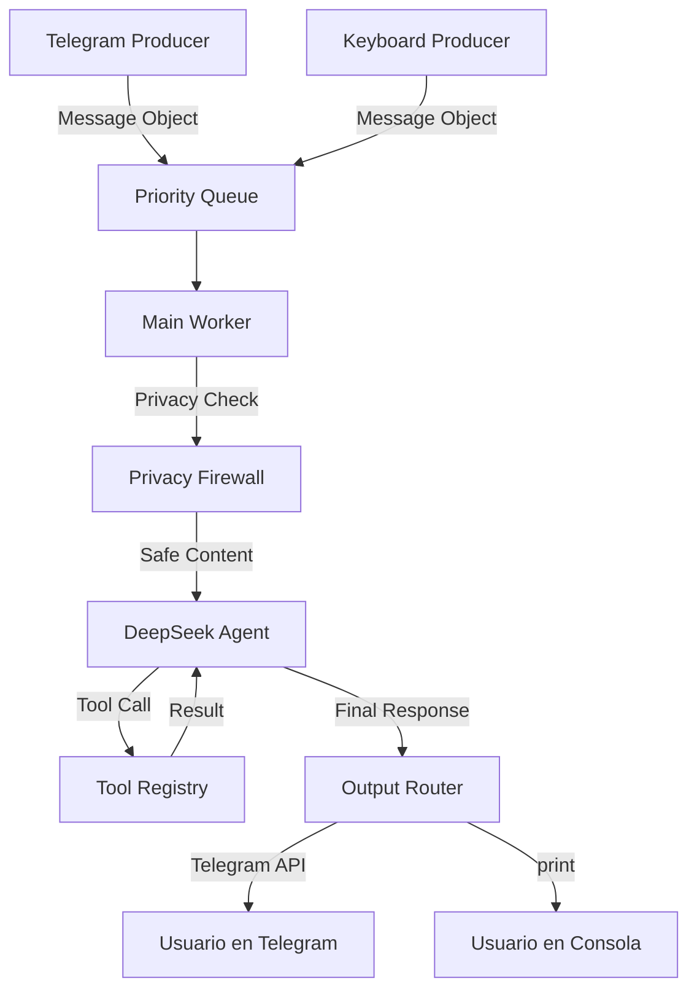

# Andrew Martin – Asistente IA con Seguridad Avanzada

[](https://www.python.org/)
[](https://platform.openai.com/)
[](LICENSE)
[](https://en.wikipedia.org/wiki/SOLID)

**Andrew Martin** (sí el de la pelicula) es un asistente conversacional inteligente desarrollado como prueba de concepto, que combina capacidades de IA con un sistema de seguridad robusto y una arquitectura modular diseñada bajo los principios SOLID.

El asistente puede interactuar con usuarios mediante un chat en terminal, verificar identidades, gestionar perfiles personales, detectar amenazas de seguridad y ejecutar herramientas especializadas (consultar información de ciudades, obtener la hora, editar archivos, etc.) utilizando el modelo de lenguaje DeepSeek.

---

## 🚀 Características principales

- **🤖 Conversación contextual** – Usa el modelo DeepSeek con capacidad de razonamiento (`reasoning_content`) para un procesamiento avanzado de peticiones.
- **⚡ Arquitectura Concurrente (Multicanal)** – Sistema basado en una **Priority Queue** con hilos independientes (`Producers`) para recibir mensajes de Telegram y Terminal simultáneamente.
- **🔐 Seguridad y Privacidad Avanzada**
  1. **Privacy Firewall** – Filtra proactivamente la información sensible (como secretos de usuario) cuando el bot detecta que está en un entorno de grupo.
  2. **Ledgers Públicos/Privados** – Los perfiles de usuario están divididos para que Andrew solo comparta información pública en chats grupales.
  3. **Logging de auditoría** – Registro detallado de amenazas en `logs/security/`.
- **🧠 Conciencia Social y Memoria**
  1. **Chat Registry** – Andrew reconoce y persiste todos los chats (privados y grupos) donde interactúa.
  2. **HistoryManager** – Mantiene un historial rodante de los últimos 100 mensajes por chat, permitiendo continuidad tras reinicios.
  3. **Memory Consolidation** – Proceso de limpieza automática mediante LLM al apagar el sistema para eliminar el "ruido" de la conversación.
  4. **Intelligence Extraction** – Análisis post-sesión que extrae automáticamente hechos relevantes (intereses, metas, recomendaciones) y los persiste en los ledgers correspondientes.
- **☁️ Cloud-Ready (Producción)**
  1. **Signal Handlers** – Manejo de `SIGTERM` y `SIGINT` para apagados controlados en contenedores.
  2. **Inactivity Monitor** – Worker en segundo plano que detecta sesiones inactivas y dispara extracción/consolidación automáticamente (sin intervención manual).
  3. **Zero-Downtime Intelligence** – Los datos se guardan incluso en entornos efímeros (Docker, Kubernetes).
- **🧰 Herramientas especializadas** – Más de 20 herramientas organizadas por dominio, incluyendo gestión de grupos, introspección de Telegram y optimización de destinos de viaje.

---

## 🏗️ Arquitectura del sistema

Andrew Martin v2.0 utiliza un diseño multi-hilo para garantizar que nunca se pierda un mensaje y que la respuesta sea fluida.

### Flujo de Datos (Message Queue System)



### Componentes clave

#### 1. **Módulo de herramientas (`tools/`)**
- **`ToolRegistry`** – Registro dinámico mediante el decorador `@tool`.
- **Organización por dominio**:
  - `user_tools.py`: Perfil público/privado y gestión de usuarios.
  - `city_tools.py`: Información de ciudades con **auto-creación de ledgers**.
  - `group_tools.py`: Herramientas para grupos (listado de miembros, administración).
  - `system_tools.py`: Introspección del bot (quién soy, en qué chats estoy).
  - `telegram_tool.py`: Comunicación de bajo nivel con la API de Telegram.

#### 2. **Gestión de Memoria (`history_manager.py`)**
- Implementa una ventana rodante para evitar el consumo excesivo de tokens mientras mantiene el contexto histórico relevante.
- Persistencia automática en `assets/history/` en formato JSON.

#### 3. **Consolidación y Extracción (`memory_consolidator.py`, `extractor.py`)**
- **Consolidación**: Al ejecutar un apagado seguro (`Ctrl+C` o señal del sistema), Andrew analiza su propia memoria y la resume para conservar solo los datos útiles para futuras interacciones.
- **Extracción de Inteligencia**: Analiza automáticamente las conversaciones para identificar y persistir hechos relevantes (intereses del usuario, metas personales, recomendaciones de lugares) en los ledgers correspondientes.

#### 4. **Mantenimiento Autónomo (`maintenance.py`)**
- Worker en segundo plano que monitorea la actividad de las sesiones.
- Dispara extracción y consolidación automáticamente cuando una sesión lleva más de 10 minutos inactiva (configurable).
- Garantiza que los datos se guarden incluso en entornos cloud sin intervención manual.

### Principios SOLID aplicados

| Principio | Cumplimiento | Ejemplo en el v2.0 |
|-----------|--------------|----------------------|
| **S**ingle Responsibility | ✅ | `Producers` solo reciben, `Worker` solo procesa, `Firewall` solo protege. |
| **O**pen/Closed | ✅ | Nuevos canales de comunicación se añaden creando un nuevo `Producer` sin tocar la lógica del Agente. |
| **L**iskov Substitution | ✅ | Los diferentes tipos de `Message` (Telegram/Terminal) se procesan uniformemente por el Agente. |
| **I**nterface Segregation | ✅ | Las herramientas están segmentadas para que el Agente solo vea lo necesario para la tarea actual. |
| **D**ependency Inversion | ✅ | El Agente no sabe de dónde viene el mensaje; solo consume objetos `Message` de la cola. |

---

## 📦 Instalación

### Prerrequisitos
- Python 3.10 o superior
- `pip` o `uv` para gestión de dependencias

### Pasos
1. Clona el repositorio (o navega al directorio del proyecto).
2. Crea un entorno virtual:
   ```bash
   python -m venv .venv
   ```
3. Activa el entorno virtual:
   - **Windows (CMD)**: `.venv/Scripts/activate`
   - **Linux/Mac**: `source .venv/bin/activate`
4. Instala las dependencias:
   ```bash
   pip install -r requirements.txt
   ```
5. Configura las variables de entorno:
   - Copia el archivo `.env.example` (si existe) a `.env` y edítalo.
   - O crea un archivo `.env` con el siguiente contenido:
     ```env
     DEEPSEEK_API_KEY=tu_clave_api_aquí
     DEEPSEEK_BASE_URL=https://api.deepseek.com
     ```
   - Si no tienes una clave de DeepSeek, puedes obtener una en [DeepSeek Platform](https://platform.deepseek.com/).

---

## ⚙️ Configuración

### Variables de entorno
| Variable | Descripción | Valor por defecto |
|----------|-------------|-------------------|
| `DEEPSEEK_API_KEY` | Clave de API para autenticar con DeepSeek. | (requerida) |
| `DEEPSEEK_BASE_URL` | URL base de la API de DeepSeek. | `https://api.deepseek.com` |
| `TELEGRAM_BOT_TOKEN` | Token del bot de Telegram (obtenido de @BotFather). | (opcional, necesario para usar herramientas de Telegram) |
| `TELEGRAM_CHAT_ID` | ID del chat donde enviar mensajes por defecto. | (opcional) |
| `SESSION_INACTIVITY_MINUTES` | Minutos de inactividad antes de disparar extracción automática. | `10` |

### Configuración de seguridad
Edita `security_config.py` para ajustar:
- **Patrones de detección** (`SECURITY_CONFIG["patterns"]`) – Expresiones regulares que identifican amenazas.
- **Respuestas predefinidas** (`SECURITY_CONFIG["responses"]`) – Mensajes que el asistente devolverá cuando se detecte una amenaza.
- **Políticas de seguridad** (`SECURITY_CONFIG["security_prompt"]`) – Texto que se inyecta en el prompt del sistema.

---

## 🚀 Uso

### Iniciar el asistente
Ejecuta el script principal:
```bash
python main.py
```

Verás la bienvenida y el banner de seguridad. El asistente estará listo para recibir tus mensajes.

### Flujo típico de conversación
1. **Presentación** – El asistente se presenta como “Andrew Martin”.
2. **Solicitud de nombre** – Pregunta tu nombre (si no lo has proporcionado).
3. **Verificación de identidad** – Si eres un usuario conocido, te pedirá tu “secreto”.
4. **Acceso al perfil** – Una vez verificado, el asistente usará tu perfil internamente para personalizar la conversación (sin revelar datos sensibles).
5. **Ejecución de herramientas** – Puedes hacer preguntas que requieran el uso de herramientas (ej. “¿Qué tiempo hace en Bogotá?”, “Añade un usuario llamado María”, “Envía un mensaje por Telegram a Juan”).
6. **Salida** – Escribe `exit`, `quit` o `bye` para terminar la sesión.

### Comandos especiales
| Comando | Acción |
|---------|--------|
| `exit`, `quit`, `bye`, `adios`, `hasta luego` | Finaliza la conversación y muestra un mensaje de despedida. |
| (vacío) | El asistente preguntará “¿En qué puedo ayudarte?”. |

---

## 📁 Estructura del proyecto

```
Agent-Telegram/
├── main.py                          # Orquestador multi-hilo (Producers + Worker)
├── src/
│   ├── core/
│   │   ├── agents.py                # Lógica del agente y orquestación de turnos
│   │   ├── models.py                # Definición de clases Message y tipos de datos
│   │   ├── history_manager.py       # Gestión de persistencia de mensajes (Rolling 100)
│   │   ├── chat_registry.py         # Registro persistente de chats y grupos
│   │   ├── memory_consolidator.py   # LLM para limpieza de historia al apagar
│   │   ├── extractor.py             # Extracción de inteligencia post-sesión
│   │   ├── maintenance.py           # Monitor de inactividad para cloud
│   │   ├── performance.py           # Sistema de benchmarking persistente
│   │   └── utils.py                 # Decoradores y utilidades
│   ├── security/                    # Módulo de protección
│   │   ├── detector.py              # Detección de amenazas (PatternThreatDetector)
│   │   ├── logger.py                # Registro de auditoría
│   │   └── config.py                # Configuración de políticas y factory
│   └── tools/                       # Herramientas dinámicas (@tool)
│       ├── user_tools.py            # Gestión de perfiles (+ update_user_info)
│       ├── city_tools.py            # Información geográfica optimizada
│       ├── group_tools.py           # Gestión de miembros y grupos de Telegram
│       ├── system_tools.py          # Introspección (Quien soy, donde estoy)
│       ├── telegram_tool.py         # Wrapper de la API de Telegram
│       ├── datetime_tool.py         # Fecha y hora
│       └── misc_tools.py            # Utilidades generales
├── tests/                           # Suite de pruebas automatizadas
│   ├── integration/
│   │   ├── test_intelligence_extraction.py  # Validación de extracción
│   │   ├── test_cloud_triggers.py           # Validación de triggers cloud
│   │   └── verify_performance.py            # Verificación de benchmarks
│   ├── test_concurrency.py          # Validación de cola de prioridad
│   ├── test_privacy_firewall.py     # Pruebas de seguridad en grupos
│   └── ...                          # Otros tests de integración
├── .agent/skills/                   # Sistema de skills modulares
│   ├── python-performance/          # Skill de optimización de rendimiento
│   └── architecture-manager/        # Skill de gestión de arquitectura
├── assets/                          # Datos persistentes
│   ├── users/                       # Perfiles .ledger (Público/Privado)
│   ├── cities/                      # Info de ciudades .ledger (Auto-creables)
│   ├── groups/                      # Ledgers específicos de grupos de Telegram
│   ├── history/                     # Archivos JSON de historial por chat
│   └── system/                      # Registros globales (chat_registry.json)
├── logs/                            # Logs de seguridad y performance
├── requirements.txt                 # Dependencias
└── .env                             # API Keys y configuración
```

---

## 🧪 Testing

El proyecto incluye pruebas de integración que validan las refactorizaciones realizadas.

### Ejecutar todas las pruebas
```bash
python -m pytest test/ -v
```
O ejecuta cada archivo individualmente:
```bash
python test/test_tools_refactor.py
python test/test_security_refactor.py
```

### Cobertura de pruebas
- **`test_tools_refactor.py`** – Verifica que el `ToolRegistry` registre correctamente las herramientas, que las funciones se puedan importar y que las herramientas básicas ejecuten sin errores.
- **`test_security_refactor.py`** – Comprueba la importación de los módulos de seguridad, la creación del detector desde configuración, la detección de amenazas con casos conocidos y el funcionamiento del logger.

Los tests también aseguran que las modificaciones respeten los principios SOLID y no rompan la funcionalidad existente.

---

## 🔄 Contribuciones

Las contribuciones son bienvenidas. Si deseas mejorar el proyecto:

1. **Haz un fork** del repositorio.
2. **Crea una rama** para tu funcionalidad (`git checkout -b feature/nueva-funcionalidad`).
3. **Realiza tus cambios** siguiendo las convenciones de código existentes.
4. **Añade pruebas** que cubran los nuevos comportamientos.
5. **Ejecuta los tests** para asegurar que nada se rompe.
6. **Envía un pull request** con una descripción clara de los cambios.

### Guías de estilo
- **Nombrado** – Usa `snake_case` para funciones y variables, `CamelCase` para clases.
- **Documentación** – Incluye docstrings en inglés o español para módulos, clases y funciones públicas.
- **Principios SOLID** – Mantén la arquitectura modular y las dependencias invertidas.

---

## 📄 Licencia

Este proyecto está licenciado bajo la **MIT License**. Consulta el archivo [LICENSE](LICENSE) para más detalles.

---

## 🫂 Agradecimientos

- **DeepSeek** – Por proporcionar un modelo de lenguaje potente y accesible.
- **OpenAI** – Por la biblioteca `openai` que facilita la integración con APIs compatibles.
- **Comunidad de Python** – Por las innumerables librerías y buenas prácticas que hacen posible proyectos como este.

---

## 📞 Contacto

Si tienes preguntas, sugerencias o encuentras algún problema, puedes:

- Abrir un **issue** en el repositorio.
- Contactar al mantenedor del proyecto a través de los canales habituales.

**¡Disfruta conversando con Andrew Martin!**
