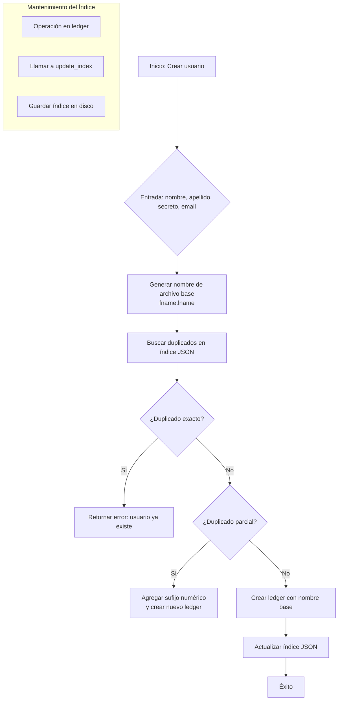

# Plan de Solución: Mejora de Nombrado de Ledgers y Búsqueda de Usuarios (Revisado)

## Problema Identificado
El agente ha creado múltiples archivos ledger para el mismo usuario debido a:
1. Incapacidad de distinguir nombres de apellidos en nombres completos.
2. Falta de detección de duplicados basada en identificadores únicos (secreto, email, username).
3. Búsqueda ineficiente de usuarios registrados, lo que lleva a crear nuevos ledgers en lugar de reutilizar existentes.
4. No hay un mecanismo claro para identificar en una cadena cuales son nombres y cuales son apellidos. Esto lleva a confusion en la asignacion de nombres a los archivos .ledger

## Objetivos
- **Unicidad**: Garantizar que cada usuario tenga un solo ledger, evitando duplicados.
- **Identificación precisa**: Mejorar la extracción de nombre y apellido para generar nombres de archivo consistentes.
- **Búsqueda eficiente**: Permitir encontrar rápidamente el ledger de un usuario dado un identificador parcial.
- **Mantenimiento de datos**: Facilitar la fusión de ledgers duplicados existentes.

## Componentes de la Solución (Revisados)

### 1. Índice JSON de Usuarios (Reemplazo de `list_users` actual)
**Problema actual**: `list_users` escanea el directorio `assets/users/` y devuelve solo los nombres de archivo, sin información contextual.

**Propuesta**:
- Crear un archivo índice JSON `assets/system/users_index.json` que contenga un array de objetos, cada uno con:
  - `full_name`: Nombre completo del usuario (tomado de `public_profile.name`).
  - `ledger_filename`: Nombre del archivo ledger (ej. `roman.castañeda.ledger`).
  - `email`: Correo electrónico si está disponible (de `public_profile.contact_email` o campo dedicado).
  - `telegram_username`: Opcional, extraíble del chat_registry o de un campo en el ledger.
  - `secret_hash`: Hash del secreto para detección de duplicados (sin revelar el secreto).
- **Actualización automática**: El índice se actualizará cada vez que se cree, modifique o elimine un ledger (mediante hooks en `add_user`, `update_user_info`).


**Modificación de `list_users`**:
- La herramienta `list_users` pasará a devoler el contenido del índice JSON (o una lista resumida) en lugar de escanear archivos.
- Se mantendrá la compatibilidad con el formato de salida actual (`{"usuarios": [...]}`) si es necesario, pero enriquecido con información adicional.

### 2. Sistema de Detección de Duplicados
**Nueva función**: `find_duplicate_user(user_data)` que busca coincidencias en el índice JSON (no en archivos). Esto mejora el rendimiento.

**Campos de coincidencia**:
- **Email**: Coincidencia exacta (ignore case).
- **Nombre completo normalizado**: Comparación después de normalizar (minúsculas, sin tildes, sin espacios extra).
- **Telegram username**: Si está disponible.

**Acciones**:
- Si se encuentra duplicado exacto, rechazar creación y devolver error "Usuario ya existe".
- La detección se integrará en `add_user` antes de crear el archivo.

**Interfaz**:
- Devuelve una lista de objetos con los campos del índice, ordenados por relevancia.
- Será utilizada por el agente para encontrar el ledger correcto antes de operaciones de lectura/actualización.

### 3. Registro Central de Usuarios (Índice JSON)
**Ventaja**: Elimina el escaneo de archivos en cada operación, centraliza la información para búsquedas rápidas y detección de duplicados.

**Estructura propuesta** (`assets/system/users_index.json`):
```json
{
  "version": "1.0",
  "last_updated": "2026-02-06T01:00:00Z",
  "users": [
    {
      "ledger_filename": "roman.castañeda.ledger",
      "full_name": "Roman Jesus Castañeda Roa",
      "email": "metrología@inasc.com.co",
      "telegram_username": "Roman Jesus",
      "created_at": "2026-02-05T20:35:27Z"
    },
    ...
  ]
}
```

**Mantenimiento**:
- Se proporcionará un módulo `src/agent_telegram/core/user_index.py` con funciones para:
  - `rebuild_index()`: Reconstruye el índice desde los archivos ledger.
  - `update_index(ledger_filename)`: Actualiza la entrada de un ledger específico.
  - `remove_index(ledger_filename)`: Elimina una entrada.
- El índice se actualizará de forma síncrona tras cada modificación (prefirible en segundo plano).

## Diagrama de Flujo del Proceso Mejorado



## Pasos de Implementación

### Fase 1: Crear Índice JSON y Reemplazar `list_users`
1. Agregar al módulo `src/tools/user_tools.py` con las funciones de gestión del índice.
2. Escribir script inicial para generar el índice a partir de los ledgers existentes.
3. Modificar `list_users` para que lea del índice (mantener compatibilidad).


### Fase 2: Integrar Detección de Duplicados en `add_user`
1. Implementar función `_find_duplicates(user_data)` que utilice el índice.
2. Modificar `add_user` para llamar a esta función y decidir si crear o no.
3. Ajustar la lógica de sufijo numérico para manejar duplicados parciales.

### Fase 3: Herramienta `search_users`
1. Crear nueva herramienta en `user_tools.py` con esquema adecuado.
2. Implementar búsqueda sobre el índice JSON (puede usar filtros simples).
3. Exponer la herramienta en el registro.

### Fase 4: Actualización Automática del Índice
1. Añadir llamadas a `update_index` en `add_user` y `update_user_info`.
2. Considerar también la extracción de inteligencia (`extractor`) que modifica ledgers.
3. Manejar errores y consistencia (por ejemplo, si el índice falla, regenerar).

### Fase 5: Limpieza de Duplicados Existentes
1. Script para detectar ledgers duplicados basado en secreto o email usando el índice.
2. Ofrecer fusión manual o automática (herramienta `merge_users` opcional).

## Consideraciones
- **Compatibilidad hacia atrás**: Los cambios no deben romper ledgers existentes. El índice es un añadido, no una modificación de estructura.
- **Rendimiento**: El índice en memoria (cargado una vez) permite búsquedas instantáneas.
- **Privacidad**: El índice almacena hash del secreto, no el secreto en claro. El email y nombre completo ya están en los ledgers (perfil público).
- **Concurrencia**: Usar locks al actualizar el índice si múltiples hilos pueden modificar ledgers simultáneamente.

## Próximos Pasos
1. Revisar este plan modificado con el usuario.
2. Ajustar según feedback final.
3. Implementar en modo **Code**.
4. Validar con tests.

---
*Última actualización: 2026-02-06 (Revisión 2)*